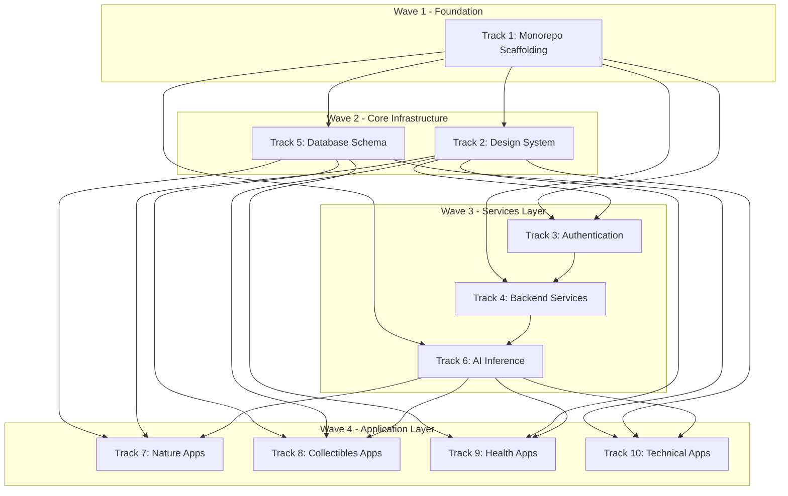

# SuperWebApp Concurrency Analysis Report

## Executive Summary

**Assessment: ✅ READY FOR CONCURRENT SUBAGENT DEVELOPMENT**

The TracksandTasks.md plan is **well-structured for parallel execution** using subagents. The 10-track architecture with explicit dependencies enables maximum concurrency while minimizing conflicts. This analysis confirms the plan is ready for execution with minor recommendations.

---

## 1. Project Scope Overview

### From SuperWebApp_Blueprint.md

| Metric | Value |
|--------|-------|
| Total Sub-Applications | 17 |
| Categories | Nature, Collectibles, Health, Pets, Automotive |
| Technology Stack | Next.js 14, FastAPI, TensorFlow, PostgreSQL, Redis |
| AI Models Required | 17+ specialized models |
| Estimated Tasks | 85+ across 10 tracks |

### Application Distribution by Track

```
Track 7: Nature & Biology → PlantID, Mushroom, BirdID, InsectID, DogBreed, CatBreed (6 apps)
Track 8: Collectibles → CoinSnap, VinylSnap, CardVault, NoteSnap (4 apps)
Track 9: Health & Fitness → Calo, FruitID, LazyFit, MuscleFit (4 apps)
Track 10: Technical → VehicleID, RockID, OkayFish (3 apps)
```

---

## 2. Track Dependency Analysis

### Dependency Graph (Mermaid)



### Critical Path Analysis

| Path | Tracks | Total Tasks | Critical? |
|------|--------|-------------|-----------|
| Foundation → UI → Auth → Apps | 1 → 2 → 3 → 7/8/9/10 | ~50 tasks | **YES** |
| Foundation → DB → Apps | 1 → 5 → 7/8/9/10 | ~35 tasks | Secondary |
| Foundation → Backend → AI → Apps | 1 → 4 → 6 → 7/8/9/10 | ~45 tasks | Secondary |

**Critical Path**: Track 1 → Track 2 → Track 3 → Application Tracks (7, 8, 9, 10)

---

## 3. Concurrency Feasibility Assessment

### ✅ Strengths of Current Plan

1. **Clear Track Boundaries**: Each track has a well-defined scope with explicit subagent responsibilities
2. **Sequential Within, Parallel Across**: Tasks within tracks are sequential, but entire tracks run in parallel
3. **Explicit Dependencies**: Each track documents what it depends on
4. **Minimal Shared Resources**: Tracks operate on different files/directories
5. **Time-Boxed Tasks**: 10-20 minute tasks are appropriate for subagent execution

### Parallel Execution Waves

| Wave | Tracks | Duration | Parallelism Level |
|------|--------|----------|-------------------|
| Wave 1 | Track 1 | ~2 hours | 1 subagent |
| Wave 2 | Tracks 2, 5 | ~3 hours | 2 subagents parallel |
| Wave 3 | Tracks 3, 4, 6 | ~4 hours | 3 subagents parallel |
| Wave 4 | Tracks 7, 8, 9, 10 | ~5 hours | 4 subagents parallel |

**Maximum Concurrency**: 4 subagents running simultaneously in Wave 4

---

## 4. Potential Bottlenecks & Conflicts

### 🔴 High-Risk Contention Points

| Bottleneck | Tracks Affected | Risk Level | Mitigation |
|------------|-----------------|------------|------------|
| `package.json` modifications | 1, 2, 3, 6 | **HIGH** | Track 1 completes first |
| `docker-compose.yml` | 1, 4, 5, 6 | **HIGH** | Track 1 owns this file |
| `apps/web/src/app/` routes | 1, 7, 8, 9, 10 | **MEDIUM** | Track 1 creates skeleton |
| Database migrations | 4, 5, 7-10 | **MEDIUM** | Track 5 owns all migrations |
| Shared types in `@photoidentifier/types` | 1, 7-10 | **MEDIUM** | Track 1 creates namespaces |

### 🟡 Medium-Risk Areas

| Area | Conflict Type | Resolution |
|------|---------------|------------|
| Tailwind config | Multiple tracks may add custom styles | Track 2 owns design tokens |
| Environment variables | Multiple services need env vars | Track 1 creates `.env.example` |
| API routes | Auth, upload, AI routes may overlap | Track 4 defines API structure |

### 🟢 Low-Risk Areas

| Area | Why Low Risk |
|------|--------------|
| Individual sub-app pages | Each track owns its app folder |
| Service code | Each track owns its service directory |
| UI components | Track 2 owns `packages/ui` |
| Database schemas per app | Track 5 creates all schemas upfront |

---

## 5. Resource Contention Matrix

```
                Track1  Track2  Track3  Track4  Track5  Track6  Track7  Track8  Track9  Track10
package.json      OWN     READ    READ    READ    READ    READ    READ    READ    READ    READ
docker-compose    OWN     -       -       MODIFY   MODIFY  MODIFY  -       -       -       -
apps/web/app      CREATE  -       MODIFY  -       -       -       OWN     OWN     OWN     OWN
packages/ui       -       OWN     READ    -       -       -       READ    READ    READ    READ
packages/types    CREATE  -       -       -       -       -       MODIFY  MODIFY  MODIFY  MODIFY
database/         -       -       -       -       OWN     -       READ    READ    READ    READ
services/         -       -       -       OWN     -       OWN     -       -       -       -
models/           -       -       -       -       -       OWN     READ    READ    READ    READ
```

**Legend**: OWN = Primary owner, MODIFY = Can modify, READ = Read-only, CREATE = Creates initial structure, - = No access

---

## 6. Recommendations for Optimal Parallel Execution

### Phase 1: Foundation (Sequential - 1 Subagent)

```
Track 1: Monorepo & Project Scaffolding
├── Task 1.1: Initialize Turborepo
├── Task 1.2: Initialize Next.js 14
├── Task 1.3: Configure TailwindCSS
├── Task 1.4: Configure ESLint/Prettier
├── Task 1.5: Set Up @photoidentifier/types
├── Task 1.6: Set Up @photoidentifier/utils
├── Task 1.7: Create Sub-App Route Structure
├── Task 1.8: Docker Compose
├── Task 1.9: Environment Configuration
└── Task 1.10: README Documentation
```

**Why Sequential**: Track 1 creates the foundation that ALL other tracks depend on. Must complete fully before Wave 2.

### Phase 2: Core Infrastructure (Parallel - 2 Subagents)

```
Subagent A: Track 2 (Design System)
├── Task 2.1: Initialize UI Package + Storybook
├── Task 2.2: Button, Input, Form Components
├── Task 2.3: Card, Badge, Alert Components
├── Task 2.4: PhotoCapture Universal Component ⭐ CRITICAL
├── Task 2.5: ConfidenceCard Components
├── Task 2.6: Navigation Components
├── Task 2.7: Data Visualization Components
├── Task 2.8: Map Components
├── Task 2.9: Modal, Dialog Components
└── Task 2.10: Loading, Error States

Subagent B: Track 5 (Database Schema)
├── Task 5.1: Alembic Setup
├── Task 5.2: Platform Core Tables
├── Task 5.3: Nature Apps Schemas
├── Task 5.4: Collectibles Apps Schemas
├── Task 5.5: Health Apps Schemas
├── Task 5.6: Pet/Vehicle Apps Schemas
├── Task 5.7: Seed Data Scripts
└── Task 5.8: Performance Indexing
```

**Why Parallel**: Track 2 (UI) and Track 5 (Database) have NO dependencies on each other.

### Phase 3: Services Layer (Parallel - 3 Subagents)

```
Subagent A: Track 3 (Authentication)
Subagent B: Track 4 (Backend Services)
Subagent C: Track 6 (AI Inference)
```

**Dependencies**:
- Track 3 needs: Track 1 ✅, Track 2 Tasks 2.1-2.2 ✅
- Track 4 needs: Track 1 ✅, Track 3 Task 3.1 (Supabase config)
- Track 6 needs: Track 1 ✅, Track 4 Task 4.1 (FastAPI template)

**Staggered Start Recommended**:
1. Start Track 3 immediately
2. Start Track 4 after Track 3 Task 3.1 completes
3. Start Track 6 after Track 4 Task 4.1 completes

### Phase 4: Application Layer (Parallel - 4 Subagents)

```
Subagent A: Track 7 (Nature Apps - 6 apps)
Subagent B: Track 8 (Collectibles Apps - 4 apps)
Subagent C: Track 9 (Health Apps - 4 apps)
Subagent D: Track 10 (Technical Apps - 3 apps)
```

**Dependencies**: All need Tracks 1, 2, 5, 6 complete ✅

**Maximum Parallelism**: 4 subagents working on independent sub-apps

---

## 7. Execution Timeline Estimate

```
Week 1:
├── Days 1-2: Track 1 (Foundation) - Sequential
├── Days 3-5: Tracks 2, 5 (Core Infrastructure) - 2 parallel
└── Days 5-7: Tracks 3, 4, 6 (Services) - 3 parallel (staggered)

Week 2:
├── Days 1-3: Tracks 3, 4, 6 (Services) - Continue
├── Days 4-7: Tracks 7, 8, 9, 10 (Applications) - 4 parallel
└── Days 7+: Integration testing, bug fixes
```

**Total Estimated Duration**: 10-14 days with 4 concurrent subagents

---

## 8. Conflict Prevention Strategies

### File Locking Strategy

| File Pattern | Owner Track | Other Tracks |
|--------------|-------------|--------------|
| `package.json` (root) | Track 1 | READ-ONLY after Track 1 |
| `docker-compose.yml` | Track 1 | READ-ONLY after Track 1 |
| `packages/ui/**` | Track 2 | READ-ONLY after Track 2 |
| `database/**` | Track 5 | READ-ONLY after Track 5 |
| `services/shared/**` | Track 4 | READ-ONLY after Track 4 |
| `models/**` | Track 6 | READ-ONLY after Track 6 |

### Communication Protocol

1. **Before Starting**: Each subagent pulls latest changes
2. **After Completing Task**: Commit + push immediately
3. **Conflict Detection**: If git conflict, pause and escalate
4. **Integration Points**: Designated merge windows between waves

---

## 9. Go/No-Go Assessment

### ✅ GO Criteria Met

| Criterion | Status | Evidence |
|-----------|--------|----------|
| Clear track boundaries | ✅ PASS | 10 tracks with explicit scopes |
| Sequential tasks within tracks | ✅ PASS | Each task builds on previous |
| Explicit dependencies | ✅ PASS | Each track lists dependencies |
| Minimal file conflicts | ✅ PASS | Different directories per track |
| Appropriate task sizing | ✅ PASS | 10-20 min tasks are manageable |
| Foundation-first approach | ✅ PASS | Track 1 must complete first |

### ⚠️ Recommendations Before Starting

1. **Track 1 Must Complete Fully**: Do not start Wave 2 until Track 1 is 100% complete and committed
2. **Stagger Wave 3**: Start Track 3 first, then Track 4 after Task 3.1, then Track 6 after Task 4.1
3. **PhotoCapture Component Priority**: Task 2.4 is critical path - prioritize completion
4. **Database Seeds**: Task 5.7 (seed data) should complete before Wave 4 starts
5. **Placeholder Models**: Task 6.6 (placeholder models) must complete before Wave 4

---

## 10. Final Verdict

### ✅ APPROVED FOR CONCURRENT SUBAGENT DEVELOPMENT

The TracksandTasks.md plan is **well-designed for parallel execution**. The 10-track structure with explicit dependencies enables:

- **Maximum 4x parallelism** in Wave 4
- **Clear ownership** of files and directories
- **Minimal merge conflicts** due to separated concerns
- **Efficient resource utilization** through wave-based execution

### Recommended Execution Order

```
┌─────────────────────────────────────────────────────────────┐
│ WAVE 1: Track 1 (Sequential)                                │
│ Duration: ~2 hours | Subagents: 1                           │
├─────────────────────────────────────────────────────────────┤
│ WAVE 2: Tracks 2, 5 (Parallel)                              │
│ Duration: ~3 hours | Subagents: 2                           │
├─────────────────────────────────────────────────────────────┤
│ WAVE 3: Tracks 3, 4, 6 (Staggered Parallel)                 │
│ Duration: ~4 hours | Subagents: 3                           │
├─────────────────────────────────────────────────────────────┤
│ WAVE 4: Tracks 7, 8, 9, 10 (Full Parallel)                  │
│ Duration: ~5 hours | Subagents: 4                           │
└─────────────────────────────────────────────────────────────┘

TOTAL: ~14 hours of subagent work across 4 waves
```

### Key Success Factors

1. ✅ **Complete Track 1 before any other tracks start**
2. ✅ **PhotoCapture component (Task 2.4) is critical - prioritize it**
3. ✅ **Database seeds (Task 5.7) must complete before app tracks**
4. ✅ **Placeholder models (Task 6.6) must complete before app tracks**
5. ✅ **Stagger Wave 3 to respect service dependencies**

---

*Analysis completed: 2026-02-22*
*Documents analyzed: SuperWebApp_Blueprint.md, TracksandTasks.md*
