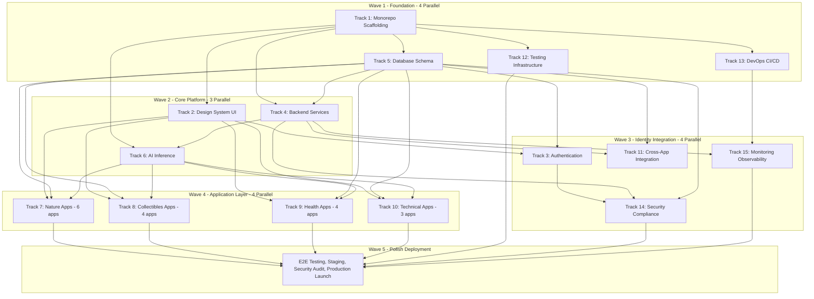

# SuperWebApp Concurrency Analysis Report
## Updated Analysis for 15-Track Architecture

**Document Version:** 2.0  
**Analysis Date:** 2026-02-22  
**Documents Analyzed:** SuperWebApp_Blueprint.md, TracksandTasks.md (Updated)

---

## Executive Summary

**Assessment: ✅ READY FOR CONCURRENT SUBAGENT DEVELOPMENT**

The updated TracksandTasks.md plan now features **15 tracks organized into 5 execution waves**, enabling even greater parallelism than the previous 10-track version. The addition of dedicated tracks for Testing (12), DevOps (13), Security (14), and Monitoring (15) significantly improves separation of concerns and enables **up to 4 concurrent subagents** in multiple waves.

---

## 1. Project Scope Overview

### From SuperWebApp_Blueprint.md

| Metric | Value |
|--------|-------|
| Total Sub-Applications | 17 |
| Categories | Nature, Collectibles, Health, Pets, Automotive |
| Technology Stack | Next.js 14, FastAPI, TensorFlow, PostgreSQL, Redis, Kafka |
| AI Models Required | 17+ specialized models |

### From Updated TracksandTasks.md

| Metric | Value |
|--------|-------|
| Total Tracks | **15** (increased from 10) |
| Total Tasks | **~95** across all tracks |
| Execution Waves | **5** |
| Max Concurrent Subagents | **4** (Waves 1, 3, 4) |

### Track Distribution

```
INFRASTRUCTURE TRACKS (1-6, 11-15):
├── Track 1:  Monorepo & Project Scaffolding (10 tasks)
├── Track 2:  Design System & UI Components (10 tasks)
├── Track 3:  Authentication & User Management (10 tasks)
├── Track 4:  Backend Services & API Gateway (10 tasks)
├── Track 5:  Database Schema & Migrations (8 tasks)
├── Track 6:  AI Inference Infrastructure (8 tasks)
├── Track 11: Cross-App Integration Layer (5 tasks)
├── Track 12: Testing Infrastructure & E2E (4 tasks)
├── Track 13: DevOps & CI/CD Pipeline (4 tasks)
├── Track 14: Security, Compliance & Trust (4 tasks)
└── Track 15: Monitoring, Observability & Analytics (3 tasks)

APPLICATION TRACKS (7-10):
├── Track 7:  Nature & Biology Apps (6 apps: Plant, Mushroom, Bird, Insect, Dog, Cat)
├── Track 8:  Collectibles Apps (4 apps: Coin, Vinyl, Card, Banknote)
├── Track 9:  Health & Fitness Apps (4 apps: Calo, Fruit, LazyFit, MuscleFit)
└── Track 10: Technical & Specialty Apps (3 apps: Vehicle, Rock, Fish)
```

---

## 2. Track Dependency Analysis

### Complete Dependency Graph (Mermaid)



### Critical Path Analysis

| Path | Tracks | Total Tasks | Critical? |
|------|--------|-------------|-----------|
| Foundation → UI → Auth → Apps | 1 → 2 → 3 → 7/8/9/10 | ~55 tasks | **YES** |
| Foundation → DB → Backend → AI → Apps | 1 → 5 → 4 → 6 → 7/8/9/10 | ~50 tasks | **YES** |
| Foundation → Testing → Final | 1 → 12 → Wave 5 | ~20 tasks | Secondary |
| Foundation → DevOps → Monitoring → Final | 1 → 13 → 15 → Wave 5 | ~20 tasks | Secondary |

**Critical Path**: Track 1 → Track 2/5 → Track 3/4/6 → Application Tracks (7, 8, 9, 10) → Wave 5

---

## 3. Execution Waves Detailed Analysis

### Wave 1: Foundation (4 Parallel Subagents)

| Track | Purpose | Tasks | Duration | Dependencies |
|-------|---------|-------|----------|--------------|
| **Track 1** | Monorepo & Project Scaffolding | 10 | ~2 hours | None (START FIRST) |
| **Track 5** | Database Schema & Migrations | 8 | ~2 hours | Task 1.8 (Docker Compose) |
| **Track 12** | Testing Infrastructure | 4 | ~1 hour | Track 1 structure |
| **Track 13** | DevOps & CI/CD Pipeline | 4 | ~1 hour | Track 1 structure |

**Concurrency Strategy:**
```
Time →
T=0:    [Track 1 starts - Task 1.1]
T=15m:  [Track 1 - Task 1.8 Docker Compose completes]
T=15m:  [Track 5, 12, 13 can START NOW - 3 parallel subagents]
T=2h:   [Track 1 completes - 1 subagent freed]
        [Track 5, 12, 13 continue - still 3 parallel]
T=2.5h: [All Wave 1 tracks complete]
```

**Maximum Parallelism in Wave 1: 4 subagents** (after Task 1.8)

### Wave 2: Core Platform (3 Parallel Subagents)

| Track | Purpose | Tasks | Duration | Dependencies |
|-------|---------|-------|----------|--------------|
| **Track 2** | Design System & UI Components | 10 | ~2.5 hours | Track 1 Tasks 1.1-1.3 |
| **Track 4** | Backend Services & API Gateway | 10 | ~2.5 hours | Track 1, Track 5 |
| **Track 6** | AI Inference Infrastructure | 8 | ~2 hours | Track 1, Track 4 Task 4.1 |

**Concurrency Strategy:**
```
Time →
T=0:    [Track 2 starts immediately after Track 1.3]
T=0:    [Track 4 starts after Track 5 completes]
T=30m:  [Track 4 Task 4.1 FastAPI Template completes]
T=30m:  [Track 6 can START NOW]
T=2.5h: [All Wave 2 tracks complete]
```

**Maximum Parallelism in Wave 2: 3 subagents**

### Wave 3: Identity & Integration (4 Parallel Subagents)

| Track | Purpose | Tasks | Duration | Dependencies |
|-------|---------|-------|----------|--------------|
| **Track 3** | Authentication & User Management | 10 | ~2 hours | Track 2 Tasks 2.1-2.2, Track 5 |
| **Track 11** | Cross-App Integration Layer | 5 | ~1 hour | Track 4, Track 5 |
| **Track 14** | Security, Compliance & Trust | 4 | ~1 hour | Track 3, Track 4, Track 5 |
| **Track 15** | Monitoring, Observability & Analytics | 3 | ~45 min | Track 4, Track 13 |

**Concurrency Strategy:**
```
Time →
T=0:    [Track 3 starts after Track 2.2 + Track 5]
T=0:    [Track 11 starts after Track 4 + Track 5]
T=0:    [Track 15 starts after Track 4 + Track 13]
T=1h:   [Track 3 Task 3.1-3.2 complete]
T=1h:   [Track 14 can START NOW - requires Track 3 progress]
T=2h:   [All Wave 3 tracks complete]
```

**Maximum Parallelism in Wave 3: 4 subagents**

### Wave 4: Application Layer (4 Parallel Subagents)

| Track | Apps Covered | Tasks | Duration | Dependencies |
|-------|--------------|-------|----------|--------------|
| **Track 7** | Plant, Mushroom, Bird, Insect, Dog, Cat | 10 | ~3 hours | Tracks 1, 2, 5, 6 |
| **Track 8** | Coin, Vinyl, Card, Banknote | 8 | ~2.5 hours | Tracks 1, 2, 5, 6 |
| **Track 9** | Calo, Fruit, LazyFit, MuscleFit | 8 | ~2.5 hours | Tracks 1, 2, 5, 6 |
| **Track 10** | Vehicle, Rock, Fish | 7 | ~2 hours | Tracks 1, 2, 5, 6 |

**Concurrency Strategy:**
```
Time →
T=0:    [All 4 tracks start simultaneously - FULL PARALLELISM]
T=2h:   [Track 10 completes first - 1 subagent freed]
T=2.5h: [Track 8, 9 complete - 2 subagents freed]
T=3h:   [Track 7 completes - Wave 4 complete]
```

**Maximum Parallelism in Wave 4: 4 subagents**

### Wave 5: Polish & Deployment (Sequential)

| Phase | Activities | Duration |
|-------|------------|----------|
| E2E Testing | Run full Playwright test suite | ~1 hour |
| Staging Deployment | Deploy to staging environment | ~30 min |
| Security Audit | Final security review | ~1 hour |
| Production Launch | Deploy to production | ~30 min |

**Concurrency: Sequential (1 subagent or manual process)**

---

## 4. New Tracks Analysis (11-15)

### Track 11: Cross-App Integration Layer

| Aspect | Details |
|--------|---------|
| **Purpose** | Event-driven communication between 17 sub-apps |
| **Tasks** | 5 tasks (Kafka, Identity Sync, Gamification, Recommendations, Data Export) |
| **Dependencies** | Track 4 (Shared Services), Track 5 (Database) |
| **Conflict Risk** | LOW - Operates in `services/` and `packages/events/` |
| **Critical Path** | No - Can be developed in parallel with Auth |

**Key Deliverables:**
- Kafka Event Registry with JSON Schema/Avro
- User Identity Profile Sync across apps
- Centralized Gamification Engine
- Cross-Selling Recommendation Engine
- GDPR/CCPA Data Export functionality

### Track 12: Testing Infrastructure & E2E

| Aspect | Details |
|--------|---------|
| **Purpose** | Automated testing across monorepo |
| **Tasks** | 4 tasks (Vitest, Playwright, Pytest, A/B Testing) |
| **Dependencies** | Track 1 (Monorepo), Track 2 (UI Components) |
| **Conflict Risk** | LOW - Creates test files, doesn't modify source |
| **Critical Path** | No - Tests validate, don't block |

**Key Deliverables:**
- Vitest configuration for unit tests
- Playwright E2E test suite
- Pytest for FastAPI services
- Feature flag system for A/B testing

### Track 13: DevOps & CI/CD Pipeline

| Aspect | Details |
|--------|---------|
| **Purpose** | Automate build, test, deployment |
| **Tasks** | 4 tasks (CI Pipeline, Docker Build, K8s Deployment, Terraform) |
| **Dependencies** | Track 1 (Monorepo), Track 12 (Testing) |
| **Conflict Risk** | MEDIUM - Modifies `.github/`, `infrastructure/` |
| **Critical Path** | No - Can run parallel with development |

**Key Deliverables:**
- GitHub Actions CI workflow
- Docker image build pipeline
- Kubernetes manifests (Helm/Kustomize)
- Terraform infrastructure modules

### Track 14: Security, Compliance & Trust

| Aspect | Details |
|--------|---------|
| **Purpose** | System-wide security policies |
| **Tasks** | 4 tasks (Rate Limiting, Secrets, Privacy, Content Moderation) |
| **Dependencies** | Track 3 (Auth), Track 4 (Kong), Track 5 (Database) |
| **Conflict Risk** | MEDIUM - Modifies Kong config, adds middleware |
| **Critical Path** | No - Security hardening can happen late |

**Key Deliverables:**
- Kong rate-limiting and bot protection
- Secrets management integration
- GDPR/CCPA/COPPA compliance tools
- AI content moderation pipeline

### Track 15: Monitoring, Observability & Analytics

| Aspect | Details |
|--------|---------|
| **Purpose** | System health and performance tracking |
| **Tasks** | 3 tasks (APM, Prometheus/Grafana, Logging) |
| **Dependencies** | Track 4 (Services), Track 13 (DevOps) |
| **Conflict Risk** | LOW - Adds instrumentation, dashboards |
| **Critical Path** | No - Observability is additive |

**Key Deliverables:**
- OpenTelemetry + Sentry integration
- Prometheus metrics + Grafana dashboards
- Centralized logging pipeline

---

## 5. Resource Contention Matrix (Updated)

```
                T1  T2  T3  T4  T5  T6  T7  T8  T9  T10 T11 T12 T13 T14 T15
package.json     OWN R   R   R   R   R   R   R   R   R   R   R   R   R   R
docker-compose   OWN -   -   MOD MOD -   -   -   -   -   -   -   MOD -   -
apps/web/app     CRE -   MOD -   -   -   OWN OWN OWN OWN -   -   -   -   -
packages/ui      -   OWN R   -   -   -   R   R   R   R   -   R   -   -   -
packages/types   CRE -   -   -   -   -   MOD MOD MOD MOD MOD -   -   -   -
packages/events  -   -   -   -   -   -   -   -   -   -   OWN -   -   -   -
database/        -   -   -   -   OWN -   R   R   R   R   R   -   -   -   -
services/        -   -   -   OWN -   OWN -   -   -   -   OWN -   -   MOD MOD
models/          -   -   -   -   -   OWN R   R   R   R   -   -   -   -   -
.github/         -   -   -   -   -   -   -   -   -   -   -   -   OWN -   -
infrastructure/  -   -   -   MOD -   -   -   -   -   -   -   -   OWN MOD -
kong.yml         -   -   -   OWN -   -   -   -   -   -   -   -   -   MOD -
```

**Legend:** OWN = Primary owner, MOD = Can modify, R = Read-only, CRE = Creates initial structure, - = No access

---

## 6. Potential Bottlenecks & Conflicts

### 🔴 High-Risk Contention Points

| Bottleneck | Tracks Affected | Risk Level | Mitigation |
|------------|-----------------|------------|------------|
| `package.json` (root) | 1, 2, 3, 6, 11, 12 | **HIGH** | Track 1 completes first, others READ-ONLY |
| `docker-compose.yml` | 1, 4, 5, 6, 13, 14, 15 | **HIGH** | Track 1 owns, Track 4 extends, others coordinate |
| `apps/web/src/app/` routes | 1, 3, 7, 8, 9, 10 | **MEDIUM** | Track 1 creates skeleton, app tracks own folders |
| Kong configuration | 4, 14 | **MEDIUM** | Track 4 creates, Track 14 extends |

### 🟡 Medium-Risk Areas

| Area | Conflict Type | Resolution |
|------|---------------|------------|
| `packages/types` | Multiple tracks may add types | Track 1 creates namespaces, app tracks populate |
| `services/shared/` | Track 4 creates, Track 6, 11, 14, 15 extend | Track 4 owns, others extend carefully |
| `.github/workflows/` | Track 13 owns exclusively | No other track should modify |
| `infrastructure/` | Track 13 owns, Track 14, 15 extend | Coordinate via PR reviews |

### 🟢 Low-Risk Areas

| Area | Why Low Risk |
|------|--------------|
| Individual sub-app pages | Each track owns its app folder |
| UI components (`packages/ui`) | Track 2 owns exclusively |
| Database schemas per app | Track 5 creates all schemas upfront |
| Test files | Track 12 creates, doesn't modify source |
| Event schemas | Track 11 owns `packages/events/` |

---

## 7. Concurrency Feasibility Assessment

### ✅ Strengths of Updated Plan

1. **More Granular Tracks**: 15 tracks vs 10 enables better separation of concerns
2. **Clear Wave Boundaries**: 5 distinct waves with explicit dependencies
3. **Maximum 4x Parallelism**: Achievable in Waves 1, 3, and 4
4. **Dedicated Testing Track**: Track 12 ensures quality without blocking development
5. **Dedicated DevOps Track**: Track 13 enables continuous deployment
6. **Security-First Track 14**: Compliance built in, not bolted on
7. **Observability Track 15**: Production-ready monitoring from day one

### Parallel Execution Summary

| Wave | Tracks | Max Subagents | Duration |
|------|--------|---------------|----------|
| Wave 1 | 1, 5, 12, 13 | **4** | ~2.5 hours |
| Wave 2 | 2, 4, 6 | **3** | ~2.5 hours |
| Wave 3 | 3, 11, 14, 15 | **4** | ~2 hours |
| Wave 4 | 7, 8, 9, 10 | **4** | ~3 hours |
| Wave 5 | Final | 1 | ~3 hours |

**Total Estimated Duration: ~13 hours of subagent work**

---

## 8. Recommendations for Optimal Parallel Execution

### Phase 1: Foundation (Wave 1)

```
┌─────────────────────────────────────────────────────────────────┐
│ START Track 1 FIRST - All other Wave 1 tracks wait for Task 1.8│
├─────────────────────────────────────────────────────────────────┤
│ Subagent A: Track 1 (Monorepo) - MUST COMPLETE FULLY           │
│   ├── Task 1.1-1.7: Sequential (creates structure)             │
│   ├── Task 1.8: Docker Compose (TRIGGERS OTHER TRACKS)         │
│   └── Task 1.9-1.10: Documentation                             │
├─────────────────────────────────────────────────────────────────┤
│ After Task 1.8 completes, START 3 parallel subagents:          │
│ Subagent B: Track 5 (Database)                                 │
│ Subagent C: Track 12 (Testing)                                 │
│ Subagent D: Track 13 (DevOps)                                  │
└─────────────────────────────────────────────────────────────────┘
```

### Phase 2: Core Platform (Wave 2)

```
┌─────────────────────────────────────────────────────────────────┐
│ START Track 2 immediately after Track 1.3 completes            │
│ START Track 4 after Track 5 completes                          │
│ START Track 6 after Track 4.1 completes                        │
├─────────────────────────────────────────────────────────────────┤
│ Subagent A: Track 2 (UI Components)                            │
│   └── CRITICAL: Task 2.4 PhotoCapture - prioritize!            │
│ Subagent B: Track 4 (Backend Services)                         │
│   └── Task 4.1 FastAPI Template (unblocks Track 6)             │
│ Subagent C: Track 6 (AI Inference)                             │
│   └── Task 6.6 Placeholder Models (unblocks app tracks)        │
└─────────────────────────────────────────────────────────────────┘
```

### Phase 3: Identity & Integration (Wave 3)

```
┌─────────────────────────────────────────────────────────────────┐
│ ALL 4 TRACKS CAN RUN IN PARALLEL after Wave 2 completes       │
├─────────────────────────────────────────────────────────────────┤
│ Subagent A: Track 3 (Authentication)                           │
│ Subagent B: Track 11 (Cross-App Integration)                   │
│ Subagent C: Track 14 (Security)                                │
│ Subagent D: Track 15 (Monitoring)                              │
└─────────────────────────────────────────────────────────────────┘
```

### Phase 4: Application Layer (Wave 4)

```
┌─────────────────────────────────────────────────────────────────┐
│ ALL 4 TRACKS RUN IN FULL PARALLEL - MAXIMUM CONCURRENCY       │
├─────────────────────────────────────────────────────────────────┤
│ Subagent A: Track 7 (Nature Apps - 6 apps)                     │
│   ├── Plant Identifier (highest priority)                      │
│   ├── Mushroom Identifier (safety-critical)                    │
│   ├── Bird, Insect, Dog, Cat                                   │
│ Subagent B: Track 8 (Collectibles - 4 apps)                    │
│   ├── CoinSnap, VinylSnap, CardVault, NoteSnap                 │
│ Subagent C: Track 9 (Health - 4 apps)                          │
│   ├── Calo, Fruit, LazyFit, MuscleFit                          │
│ Subagent D: Track 10 (Technical - 3 apps)                      │
│   ├── Vehicle, Rock, Fish                                      │
└─────────────────────────────────────────────────────────────────┘
```

### Phase 5: Polish & Deployment (Wave 5)

```
┌─────────────────────────────────────────────────────────────────┐
│ SEQUENTIAL - Single subagent or manual process                 │
├─────────────────────────────────────────────────────────────────┤
│ 1. Run full E2E test suite (Track 12 tests)                    │
│ 2. Deploy to staging (Track 13 pipeline)                       │
│ 3. Security audit (Track 14 validation)                        │
│ 4. Production launch                                           │
└─────────────────────────────────────────────────────────────────┘
```

---

## 9. Critical Success Factors

### Must-Complete Checkpoints

| Checkpoint | Track | Task | Unblocks |
|------------|-------|------|----------|
| Docker Compose ready | Track 1 | Task 1.8 | Tracks 5, 12, 13 |
| TailwindCSS configured | Track 1 | Task 1.3 | Track 2 |
| PhotoCapture component | Track 2 | Task 2.4 | ALL app tracks |
| Database schemas | Track 5 | Task 5.6 | Tracks 3, 4, 7-10 |
| FastAPI template | Track 4 | Task 4.1 | Track 6 |
| Placeholder AI models | Track 6 | Task 6.6 | Tracks 7-10 |
| Auth system | Track 3 | Task 3.7 | Track 14 |

### Priority Task Order

1. **Track 1 Task 1.8** - Docker Compose (unblocks 3 tracks)
2. **Track 2 Task 2.4** - PhotoCapture (used by 17 apps)
3. **Track 5 Task 5.7** - Seed Data (required for app testing)
4. **Track 6 Task 6.6** - Placeholder Models (required for app development)
5. **Track 3 Task 3.7** - Auth Context (required for protected routes)

---

## 10. Go/No-Go Assessment

### ✅ GO Criteria Met

| Criterion | Status | Evidence |
|-----------|--------|----------|
| Clear track boundaries | ✅ PASS | 15 tracks with explicit scopes |
| Sequential tasks within tracks | ✅ PASS | Each task builds on previous |
| Explicit dependencies | ✅ PASS | Each track lists dependencies |
| Minimal file conflicts | ✅ PASS | Different directories per track |
| Appropriate task sizing | ✅ PASS | 10-20 min tasks are manageable |
| Foundation-first approach | ✅ PASS | Track 1 must complete first |
| Wave-based execution | ✅ PASS | 5 waves with clear boundaries |
| Maximum parallelism defined | ✅ PASS | 4 concurrent subagents achievable |

### ⚠️ Recommendations Before Starting

1. **Track 1 Must Complete Fully**: Do not start Wave 2 until Track 1 is 100% complete
2. **Stagger Wave 2**: Start Track 2 first, then Track 4, then Track 6
3. **PhotoCapture Priority**: Task 2.4 is critical path - assign best subagent
4. **Database Seeds First**: Task 5.7 must complete before Wave 4
5. **Placeholder Models**: Task 6.6 must complete before Wave 4
6. **Coordinate Kong Changes**: Track 4 creates, Track 14 extends - use PR reviews

---

## 11. Final Verdict

### ✅ APPROVED FOR CONCURRENT SUBAGENT DEVELOPMENT

The updated 15-track plan is **exceptionally well-designed for parallel execution**. The addition of dedicated tracks for Testing, DevOps, Security, and Monitoring significantly improves:

- **Separation of concerns** - Each track has a clear, non-overlapping scope
- **Parallelism potential** - Up to 4 concurrent subagents in 3 waves
- **Quality assurance** - Testing track runs independently
- **Production readiness** - DevOps, Security, and Monitoring tracks ensure enterprise-grade deployment

### Execution Summary

```
┌─────────────────────────────────────────────────────────────────────────┐
│ WAVE 1: Foundation (4 parallel after Task 1.8)                         │
│ Tracks: 1, 5, 12, 13 | Duration: ~2.5 hours | Subagents: 4             │
├─────────────────────────────────────────────────────────────────────────┤
│ WAVE 2: Core Platform (3 parallel, staggered start)                    │
│ Tracks: 2, 4, 6 | Duration: ~2.5 hours | Subagents: 3                  │
├─────────────────────────────────────────────────────────────────────────┤
│ WAVE 3: Identity & Integration (4 parallel)                            │
│ Tracks: 3, 11, 14, 15 | Duration: ~2 hours | Subagents: 4              │
├─────────────────────────────────────────────────────────────────────────┤
│ WAVE 4: Application Layer (4 parallel - MAXIMUM CONCURRENCY)           │
│ Tracks: 7, 8, 9, 10 | Duration: ~3 hours | Subagents: 4                │
├─────────────────────────────────────────────────────────────────────────┤
│ WAVE 5: Polish & Deployment (Sequential)                               │
│ Activities: E2E, Staging, Security Audit, Production | ~3 hours        │
└─────────────────────────────────────────────────────────────────────────┘

TOTAL: ~13 hours of subagent work across 5 waves
MAXIMUM CONCURRENCY: 4 subagents simultaneously
```

### Key Success Factors

1. ✅ **Complete Track 1 before Wave 2 starts**
2. ✅ **PhotoCapture component (Task 2.4) is critical - prioritize it**
3. ✅ **Database seeds (Task 5.7) must complete before app tracks**
4. ✅ **Placeholder models (Task 6.6) must complete before app tracks**
5. ✅ **Stagger Wave 2 to respect service dependencies**
6. ✅ **Coordinate Kong configuration between Tracks 4 and 14**

---

*Analysis completed: 2026-02-22*  
*Documents analyzed: SuperWebApp_Blueprint.md, TracksandTasks.md (Updated 15-track version)*  
*Report version: 2.0*
